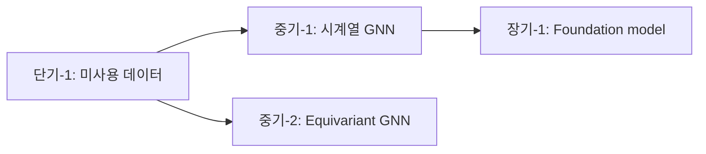

# Technical Research Report Writing

여러 산출물을 통합한 한국어 학술 보고서 작성 절차.

## 1. 작성 전 입력 자료 점검

작업 시작 전 다음을 Read로 확인:

- `_workspace/00_input/PAPER_SUMMARY.md` — 본 논문 요약
- `_workspace/01_scout-gnn-mesh.md` — GNN 동향
- `_workspace/02_scout-domain-app.md` — 도메인 응용 동향
- `_workspace/03_gap-analysis.md` — 갭 분석
- `_workspace/04_future-directions.md` — 향후 방향

**누락/부실 자료 처리**:
- 누락 시: 해당 작성자 SendMessage로 확인. 작성자 부재 시 가용 자료로 진행하고 보고서에 명시
- 부실 (인용 5건 미만 등) 시: 1회 보강 요청. 미응답 시 진행

## 2. 한국어 학술 톤 가이드

### 어조

- **종결**: ~한다 / ~된다 / ~한 것으로 분석된다
- **인용**: ~에 따르면 / ~이 보고된 바 있다 / ~로 알려져 있다
- **자제**: ~합니다 / ~죠 / ~네요 (구어체 금지)
- **자제**: 과도한 단정 ("반드시", "절대로") — 학술 텍스트는 가능성/추정 표현 선호

### 기술 용어 표기

- 첫 등장: **한글 (영문)** 형식 — 예: "그래프 신경망(Graph Neural Network, GNN)"
- 이후: 영문 약어 또는 한글 일관성 유지
- 약어 정리: 부록 B에 모든 약어 정리

### 수치 표기

- 단위 일관성: SI 단위 (Pa, m, s) 또는 응용 단위(MPa, mm) 한 가지로 통일
- 정확도: 의미 있는 자릿수만 (예: MAPE 7.04% → 7.0%)
- 통계: 표준편차/신뢰구간 함께 (예: 0.070 ± 0.004)

## 3. Narrative 재구성

산출물은 4명이 작성한 만큼 **톤과 시각이 다르다**. 보고서는 단일 작가의 글처럼 읽혀야 한다:

| 단계 | 작업 |
|---|---|
| 1. 정렬 | 4개 산출물의 핵심 메시지를 순서대로 나열 (보고서 6개 장 흐름) |
| 2. 통합 | 동일 인용/사실이 여러 산출물에 있으면 가장 적합한 위치에 1회만 |
| 3. 재작성 | 산출물 문장을 그대로 복사하지 않고, 보고서 톤으로 다시 씀 |
| 4. 연결 | 장 사이 / 절 사이 자연스러운 transition 작성 |
| 5. 강조 | TL;DR, 핵심 표, Top 5 등으로 가독성 강화 |

## 4. Executive Summary 작성

**가장 중요한 1페이지**. 보고서의 핵심을 추출:

```markdown
## Executive Summary

본 보고서는 [본 논문]을 발전시키기 위한 최신 연구 동향과 향후 방향을 분석하였다.

### 주요 발견 (5-7개)
1. [발견 1] — [한 줄 요약]
2. ...

### 본 논문 평가
- **강점**: [3개 요약]
- **갭**: [핵심 갭 3개]

### 추천 우선순위 Top 3
1. [단기 1순위] — [목표 + 일정]
2. [중기 1순위]
3. [전략 방향]

### 보고서 구성
- 2장: GNN 동향
- 3장: 도메인 응용
- 4장: 갭 분석
- 5장: 향후 방향
```

읽는 사람이 1페이지만 읽고도 핵심을 파악할 수 있어야 한다.

## 5. 본문 장별 작성 가이드

### 1장 서론
- 1.1 보고서 목적 — 왜 이 보고서를 작성했는가
- 1.2 본 논문 핵심 정리 — 1페이지로 압축 (PAPER_SUMMARY.md 기반)
- 1.3 보고서 구성

### 2장 GNN 및 Mesh-based Simulation 동향
- scout-gnn-mesh 산출물 기반 재작성
- 각 절 시작에 TL;DR 1-2 문장
- 표/그림 활용:
  - "주요 GNN 아키텍처 비교" 표
  - "Neural Operator 계열 분류" 표

### 3장 자동차·구조해석 AI Surrogate 동향
- scout-domain-app 산출물 기반 재작성
- 응용 영역별 사례 정리 표
- "산업 적용 단계" 컬럼으로 TRL 시각화

### 4장 본 논문 갭 분석
- gap-strategist 산출물 1 기반
- SWOT 4분면 표 그대로 활용
- 5축 매트릭스 표 그대로 활용
- 핵심 갭 Top 5는 각각 1-2 페이지 분량

### 5장 향후 연구 방향
- gap-strategist 산출물 2 기반
- 단/중/장기 분류 유지
- Top 5는 별도 강조 박스
- 의존 관계 그래프 (mermaid 또는 표)

### 6장 결론
- 6.1 종합 평가 — 본 논문의 위치 (학술/산업 측면)
- 6.2 즉시 착수 권장 액션 — 3-5개
- 6.3 향후 모니터링 대상 — 학회/기술 동향

## 6. 표/그림 활용

### 권장 표 / 시각

- **장 2**: "GNN 아키텍처 비교 표" (제안 연도 / 파라미터 / 적용 도메인)
- **장 3**: "자동차 AI Surrogate 응용 사례 표" (영역 / 데이터 / TRL)
- **장 4**: "5축 갭 매트릭스" + "SWOT 4분면"
- **장 5**: "단/중/장기 로드맵 표" + "의존 관계 그래프"
- **장 6**: "추천 액션 Top 5 우선순위 매트릭스"

### Mermaid 활용 (의존 관계 / 흐름)



## 7. 인용 형식

### 본문 인용

- 1차 인용: `(Pfaff et al., 2021)` — 이름 + 연도
- 다회 인용: `[6]` — 번호 사용 (부록 A에 매핑)
- 직접 인용 (드물게): `"..." (Pfaff et al., 2021, p. 3)`

### 부록 A 참고 문헌 형식

```
[1] Kim, C. et al. (2026). Developing of an Geometry-aware AI model for
    Predicting Stress Distribution in Aluminum Wheels under Impact.
    JSAE.
[2] Pfaff, T., Fortunato, M., Sanchez-Gonzalez, A., & Battaglia, P. (2021).
    Learning Mesh-Based Simulation with Graph Networks.
    International Conference on Learning Representations (ICLR).
    https://arxiv.org/abs/2010.03409
```

저자 / 연도 / 제목 / 학회 또는 저널 / DOI 또는 URL

## 8. 검증 체크리스트 (제출 전)

- [ ] Executive Summary 1페이지 이내
- [ ] 모든 인용 부록 A에 등록됨 (본문 [N] ↔ 부록 [N] 일치)
- [ ] 모든 약어 부록 B에 정의됨
- [ ] 표/그림에 캡션과 번호 (그림 1, 표 1, ...)
- [ ] 6개 장 모두 TL;DR 시작
- [ ] 본 논문 핵심 수치 일치 (Top 20% MAPE 7.0%, 580 샘플 등)
- [ ] 한국어 학술 톤 일관성
- [ ] 분량: 30-50페이지 (Executive Summary 별도)
- [ ] 부록 C에 본 논문 핵심 수치 재정리

## 9. 출력 위치

- 최종 보고서: `최종_연구동향_및_향후방향_보고서.md` (프로젝트 루트)
- 중간 산출물: `_workspace/_drafts/v1.md`, `v2.md` (작성 진행 중인 버전)

## 10. 종료 후

- 파일 작성 완료 시 리더(오케스트레이터)에게 SendMessage로 알림
- 사용자 피드백 수신 시 해당 부분 수정 → 새 버전 저장 (`v2.md`)
- 최종 승인 후 `최종_..._보고서.md`로 확정
